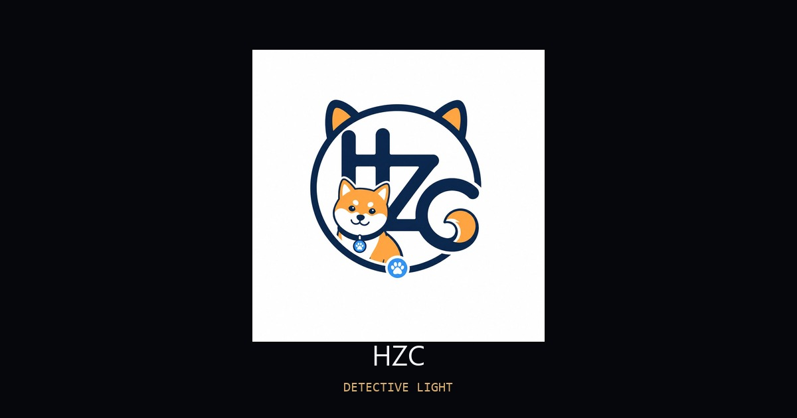

<div align="center">

# 菠萝包 & さと — HTML Light Demo

一个由 Three.js 驱动的 **HTML-in-Canvas** 侦探搭档灯光互动页面。<br />
An interactive **HTML-in-Canvas** lighting experiment powered by Three.js.

<p><strong>灵感来源于 <a href="https://x.com/kaolti">@kaolti</a> 的原作。<br />An unofficial recreation of <a href="https://x.com/kaolti">@kaolti</a>'s project.</strong></p>

<a href="https://hanzichuan5-ctrl.github.io/HTML-Light-Demo/">
  
</a>
<a href="https://x.com/LazyGooooo">
  
</a>

**[在线体验 Demo →](https://hanzichuan5-ctrl.github.io/HTML-Light-Demo/)**

</div>



HTML Light Demo 通过 [`three-html-render`](https://www.npmjs.com/package/three-html-render) 将真实 HTML 界面渲染到 Three.js 场景中，再用一盏物理模拟的悬挂射灯照亮它。拖动灯、调整光束、切换颜色与亮度——HTML 表面实时响应。

HTML Light Demo renders a real HTML interface inside a Three.js scene with
[`three-html-render`](https://www.npmjs.com/package/three-html-render), then
illuminates it with a physics-driven hanging spotlight. Pull the lamp, reshape
the beam, and change its color or brightness — the HTML surface reacts in real
time.

## Highlights · 核心亮点

- **HTML-in-Canvas** — 真实 HTML 渲染进 WebGL
- **物理摆锤** — 基于约束 Verlet 求解器的悬挂灯物理模拟
- **实时灯光调节** — 光束角度、亮度、颜色、功率均可动态调整
- **侦探彩蛋玩法** 🕵️ — 30 个隐藏线索分布在场景中，移动灯光照亮特定区域即可发现
  - 两种类型：短语线索（中/日双语）和环境线索（脚印、星点、暗号等视觉特效）
  - 每轮随机刷出 6 个线索，全部找齐后进入下一轮
  - **侦探手册** — 记录收藏进度、发现总数、完成轮数，支持回放 & 清空
  - 进度自动保存到浏览器本地存储，音效可开关
- **鼠标交互** — 拖拽瞄准、松手释放动量、双击重置
- **智能休眠渲染** — 场景稳定时自动暂停渲染帧，降低开销
- Real HTML rendered into WebGL through HTML-in-Canvas
- Physically simulated pendulum motion with a constrained Verlet solver
- Live spotlight angle, brightness, color, and power controls
- **Detective egg hunt** 🕵️ — 30 hidden clues to discover by moving the light
  - Two types: phrase clues (Chinese/Japanese) and environment effects (footprints, stars, cipher, etc.)
  - 6 random clues per round; complete a round to advance
  - **Detective Notebook** — collection progress, discovery stats, replay & clear
  - Progress saved to localStorage; toggleable sound effects
- Mouse-driven aiming, pulling, release momentum, and reset interactions
- Idle-aware rendering that sleeps when the scene is stable

## Controls · 操作方式

| 操作 Input | 效果 Action |
| --- | --- |
| 鼠标左键拖拽 · Left drag | 拖拽并瞄准灯光 · Pull and aim the lamp |
| 松开左键 · Release | 释放灯光，自由摆动 · Let the lamp swing freely |
| 鼠标右键拖拽 · Right drag | 调节光束角度 · Adjust the beam angle |
| 鼠标右键点击 · Right click | 切换灯光颜色 · Cycle the light color |
| 双击 · Double-click | 重置灯光位置 · Reset the lamp |

## Built With · 技术栈

- [three-html-render](https://www.npmjs.com/package/three-html-render) — HTML-in-Canvas rendering
- [Three.js](https://threejs.org/) — 3D scene, materials, and lighting
- [React](https://react.dev/) and [TypeScript](https://www.typescriptlang.org/) — interface and application logic
- [Vinext](https://github.com/cloudflare/vinext) and [Vite](https://vite.dev/) — development and build pipeline

## Getting Started · 本地开发

需要 Node.js 22.13 或更新版本 · Requires Node.js 22.13 or newer.

```bash
git clone https://github.com/hanzichuan5-ctrl/HTML-Light-Demo.git
cd HTML-Light-Demo
npm install
npm run dev
```

质量检查 · Quality checks:

```bash
npm run lint
npm test
```

## Credits · 致谢

原创概念和艺术指导来自 [@kaolti](https://x.com/kaolti)。这是一个独立实现，仅用于学习和展示，与原作者无官方关联。

Original concept and art direction by [@kaolti](https://x.com/kaolti). This
independent implementation was created for learning and demonstration and is
not officially affiliated with the original creator.

## License · 许可

基于 [MIT License](./LICENSE) 发布 · Released under the [MIT License](./LICENSE).
